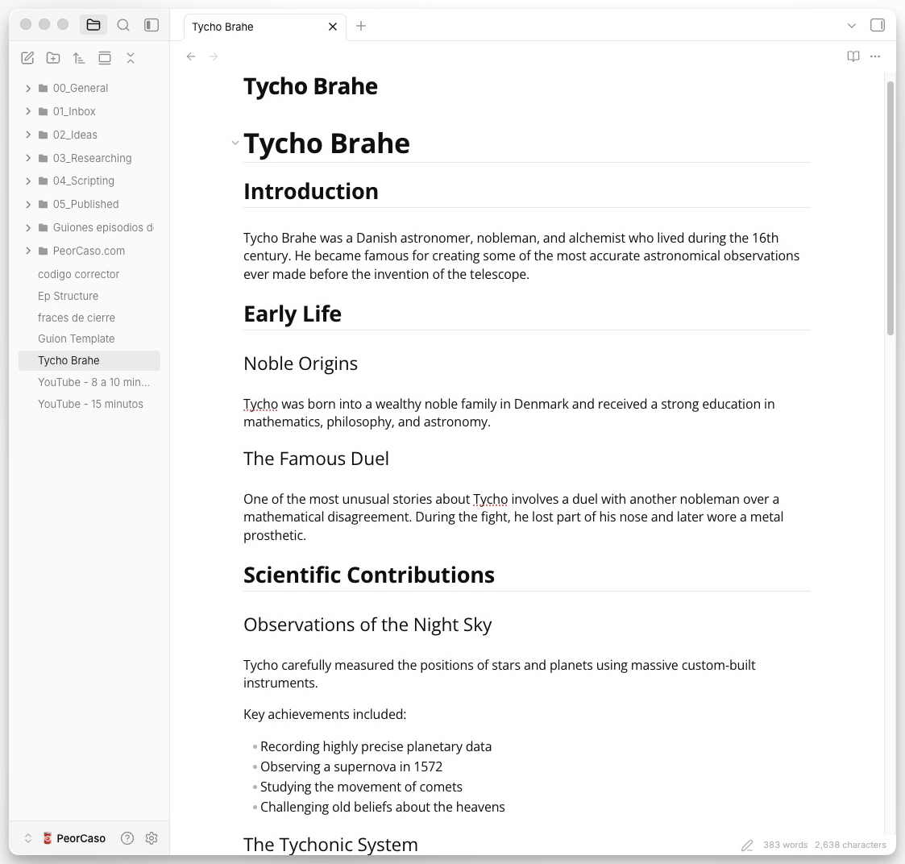

# Editorial Minimal

Editorial Minimal is an Obsidian theme inspired by Typora and GitHub styles, designed to provide a clean space to focus on ideas and easy navigation for research.

The theme focuses on a simple document canvas, Open Sans typography, compact paragraph rhythm, Typora-style heading rules, and PDF export spacing tuned for long-form writing and reading.

## Features

- Typora- and GitHub-inspired editor and reading layout
- Open Sans typography support through Obsidian font settings
- Subtle heading dividers for H1 and H2
- Compact paragraph spacing in live preview
- Print and PDF export refinements for heading spacing and page breaks
- Folder icons in the left pane for faster visual navigation
- Sidebar styling with a minimal file explorer treatment

## Recommended Settings

For the closest appearance, set Obsidian's text font and interface font to Open Sans.

## License

This theme is released under the MIT License. See [LICENSE](LICENSE) for details.
